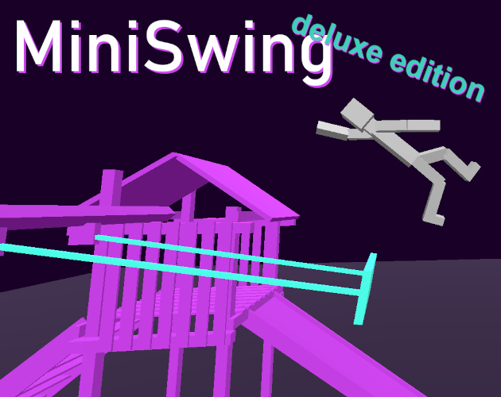
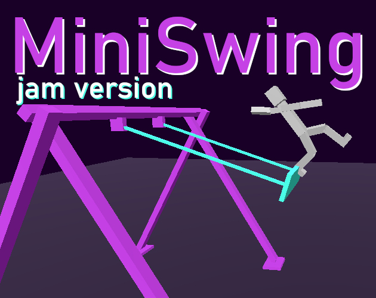

# MiniSwing

Now with deluxe features such as music, sounds, an even bigger swing, the same frustration!

Originally made for [Mini Jam 167](https://itch.io/jam/mini-jam-167-cyber) in the final 6 hours, the deluxe edition contains 4 more hours of work.

# MiniSwing (jam version)

A little game made for [Mini Jam 167](https://itch.io/jam/mini-jam-167-cyber) in the final 6 hours.

Play the jam version here: https://gheja.itch.io/miniswing

Source code of the jam version: https://github.com/gheja/miniswing/tree/jam-version

